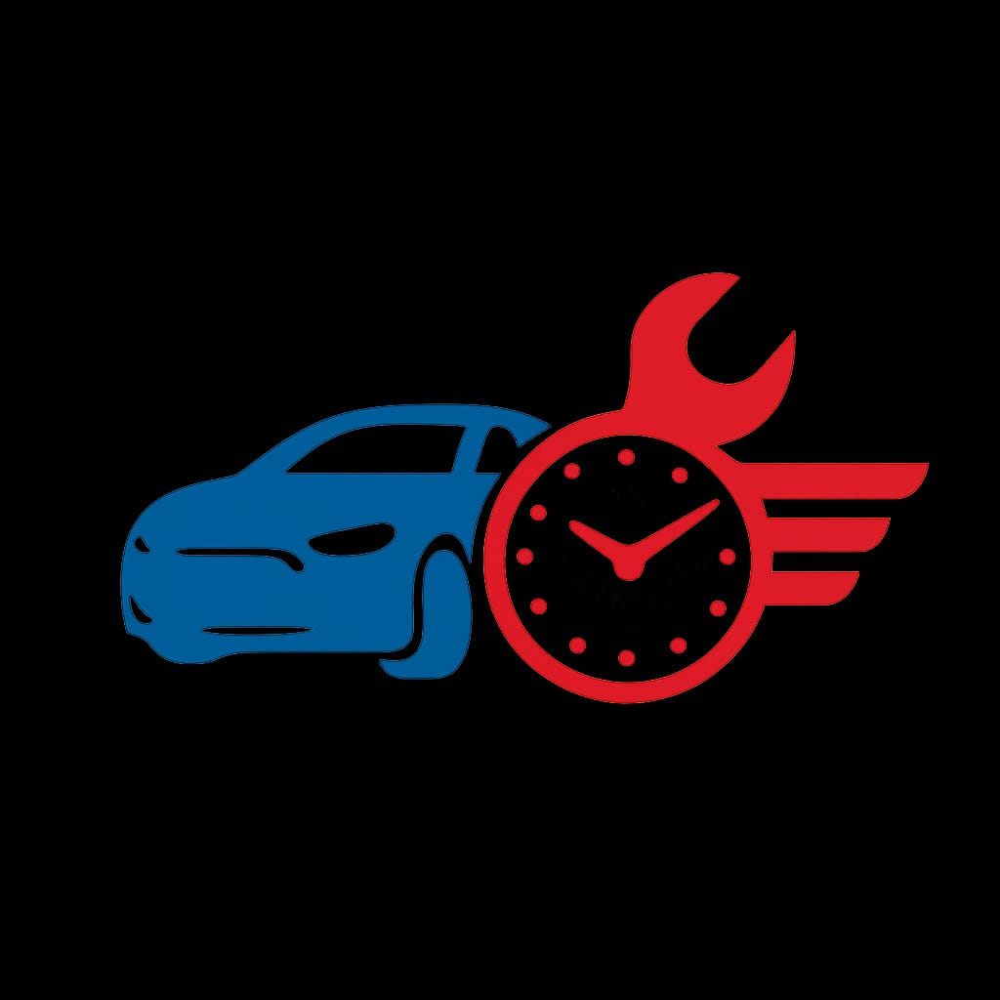

<div align="center">
  

  # 🚗 DRIVER TIME 
  [cite_start]**Sistema de Agendamento e Atendimento de Oficina Automotiva** [cite: 1, 5]

  *Um projeto de TCC desenvolvido para modernizar e organizar a gestão de oficinas mecânicas.*

  [](#)
  [](#)
  [](#)
  [](#)
</div>

<br>

## 📋 Sobre o Projeto

[cite_start]O **Driver Time** é uma aplicação web desenvolvida como Trabalho de Conclusão de Curso (TCC) para o curso de **Tecnologia em Sistemas para Internet** no **Instituto Federal do Acre (IFAC) - Campus Rio Branco**[cite: 2, 3, 4, 6]. 

[cite_start]O objetivo principal do sistema é solucionar problemas comuns encontrados no dia a dia de oficinas automotivas, como a dependência de papel e WhatsApp para agendamentos, a comunicação desorganizada e a falta de histórico e controle técnico dos veículos[cite: 8, 9, 10, 11, 12]. [cite_start]O sistema propõe a eliminação do papel, trazendo visualização financeira imediata e histórico organizado[cite: 34].

---

## 🛠️ Funcionalidades

[cite_start]A aplicação adota uma arquitetura **SPA (Single Page Application)** com processamento *Client-Side*, simulando o tempo real via *Event Listeners* e utilizando **LocalStorage e JSON** para armazenamento de dados no navegador[cite: 24, 27, 28]. O sistema é dividido em duas interfaces principais:

### 📱 Módulo do Cliente (`oficina.html`)
- [cite_start]**Cadastro e Login:** Acesso seguro com e-mail e senha, incluindo recuperação de acesso[cite: 16].
- [cite_start]**Agendamento Inteligente:** Marcação de serviços escolhendo data, hora, tipo do veículo, detalhamento de quilometragem e até solicitação de guincho[cite: 17].
- [cite_start]**Acompanhamento e Histórico:** Visualização do status da revisão (Pendente, Em Andamento, Concluído) e gráficos de pizza do histórico de serviços utilizando Chart.js[cite: 19].
- **Tabela de Preços Referencial:** Acesso rápido aos valores cobrados por tipo de serviço e tamanho do veículo.
- [cite_start]**Feedback e Avaliação:** Sistema para deixar comentários pós-serviço[cite: 20].
- **Suporte em Tempo Real:** Chat integrado para falar diretamente com a mecânica.

### ⚙️ Módulo do Funcionário/Admin (`oficinaFuncionario.html`)
- **Painel de Controle (Dashboard):** Visão geral dos agendamentos pendentes.
- [cite_start]**Gestão de Checklist Técnico:** Formulário detalhado de avarias (Frente, Traseira, Motorista, Passageiro, Motor)[cite: 18].
- [cite_start]**Relatórios Gerenciais:** Geração de gráficos dinâmicos de faturamento e quantidade de serviços filtrados por mês[cite: 21].
- **Tabela de Preços Dinâmica:** CRUD (criação, leitura, atualização e exclusão) completo dos valores cobrados na oficina.
- **Central de Mensagens:** Recebimento e resposta dos chats iniciados pelos clientes.
- **Histórico e Feedbacks:** Ferramenta de busca avançada por placa ou modelo e visualização das avaliações dos clientes.

---

## 💻 Tecnologias Utilizadas

Este projeto foi construído utilizando tecnologias web padrão para garantir leveza e rápida prototipagem:

* [cite_start]**Front-end:** HTML5, CSS3, JavaScript (Vanilla)[cite: 25].
* [cite_start]**Visualização de Dados:** Chart.js[cite: 25].
* [cite_start]**Armazenamento:** Web Storage API (LocalStorage)[cite: 27].
* [cite_start]**Arquitetura:** SPA & Client-Side Logic[cite: 24].

---

## 🚀 Como Executar o Projeto

[cite_start]Como o projeto não utiliza um servidor de banco de dados tradicional no momento (os dados ficam salvos no navegador), rodar a aplicação é extremamente simples[cite: 35].

1. Faça o clone deste repositório:
   ```bash
   git clone [https://github.com/SEU_USUARIO/driver-time.git](https://github.com/SEU_USUARIO/driver-time.git)
